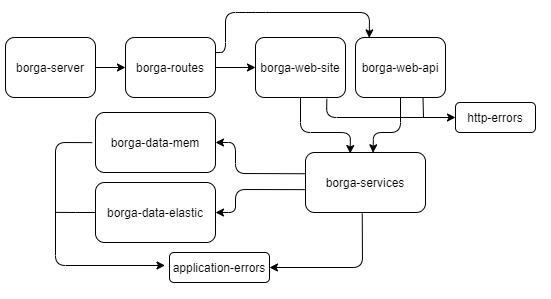
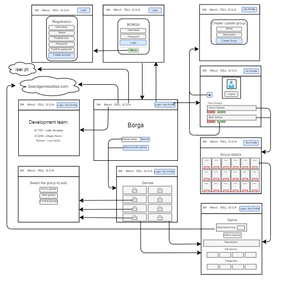

# **Application Structure Description**

## **Server**
The structure of the server-side of this application is depicted below. You can observe that the first module, `borga-server`, is used to start the application, serving as the entry point.



### **Responsibilities of each module:**
- `borga-routes`: Interconnects modules and declares middlewares for certain routes.
- `borga-web-api`: Implements the corresponding HTTP routes for the application's REST API.
- `borga-web-site`: Implements the HTTP routes used for the application's website.
- `users-web-site`: Implements the HTTP routes for user login and logout.
- `borga-services`: Implements the logic for each provided functionality.
- `board-games-data`: Implements access to the Board Game Atlas API.
- `borga-data-mem`: Implements access to data stored in memory, specifically, in the borga-database file.
- `borga-data-elastic`: Implements access to data stored in the ElasticSearch database.
- `application-errors`: Contains all errors related to the application's logic, consisting of a code and a message.
- `http-errors`: Implements the transformation of application errors into HTTP errors.

## **Client**

Regarding the client-side, when a user interacts with the application through a browser, any operation will result in an HTTP request to the server. The server, upon receiving and processing the request, will respond with HTTP results to the client. While most requests are processed through the `web-site` module, edit and removal requests are handled by the `web-api` module, as PUT and DELETE requests through a browser can only be executed from client-side JavaScript code.

### **Site Navigation Structure**



## **Data Storage Structure**

### **In Memory**
Four objects were created to ensure that all data read and/or written could be performed with a **time complexity of** `O(1)`, allowing operations on the data to be as fast as possible.

```javascript
const user = {
  token: {
    username: "...",
    name: "...",
    club: "..."
  }
}

const credentials = {
  username: {
    password: "...",
    token: "..."
  }
}

const games = {
  gameId: {
    id: "...",
    name: "...",
    url: "...",
    image_url: "...",
    mechanics: [],
    categories: []
  }
}

const groups = {
  token: new Map([
    [
      groupId, { 
        name: "...",
        description: "...",
        games: new Set([ gameId ])
      }
    ]
  ])
}
```

### **In ElasticSearch**
Four documents were created with the same goal, i.e., to obtain data as quickly as possible, each containing the properties described below the URI.

```plaintext
credentials/_doc/{username} -> password, token
users/_doc/{token} -> username, name, club
games/_doc/{gameId} -> id, name, url, image_url, mechanics[], categories[]
groups-{token}/_doc/{groupId} -> name, description, games[gameId]
```

## **Mapping between ElasticSearch Documents and Web Application Objects**

To minimize differences between them, the data inserted in the ElasticSearch documents largely corresponds to the data needed for the web application. When additional properties are required that are present in other documents or when filtering is necessary, this process is carried out in the module that connects to the database for each functionality.

## **Server API Documentation**

The API documentation can be accessed by opening the [YAML file](docs/borga-api-spec.yaml) located in the `'docs/'` directory. The documentation was developed using [Swagger](https://swagger.io/) and follows the OpenAPI specification.

In the same directory, you will also find a [JSON file](docs/borga-api-test.json) containing an extensive list of tests performed on each API endpoint using the Postman App. This JSON file can be conveniently imported for testing purposes.

## **Instructions to Run the Application**

Before performing any operation, it is necessary to **install the required modules**. To do this, simply execute the command `npm install` when at the project's root directory.

### **Tests**
The tests were performed using data previously inserted in the `borga-database-tests` file, exclusively for testing purposes. Therefore, if you want to perform more tests and add more test data, this is the file to modify, or any other file, as long as the data structure is the same. 

Tests were conducted for the `services` module and the `web-api` module, with the latter requiring an internet connection.

To run both tests, simply enter the command `npm test` in the command line at the project's root directory. 

#### **Please note** that for the tests related to the ***web-api*** to pass successfully, it is necessary to set an **environment variable** with the key `ATLAS_CLIENT_ID`, where its value should correspond to the `client_id` assigned by Board Game Atlas. If you don't have it yet or don't remember it, you can check it at [Board Game Atlas](https://www.boardgameatlas.com/api/docs/apps).

### **Running the Application**
After installing the necessary modules and setting your `client_id` for Board Games Atlas in the environment variable as described above, you are ready to run the application. To do this, enter the command `npm start` in the command line at the project's root directory. 

Now, when you access the site **http://localhost:1904/** (by default, if you have changed it, use the modified address), you can navigate through its features.